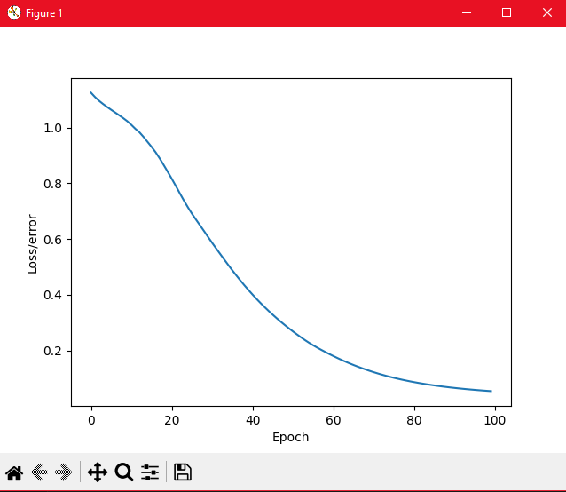

I am using this project to help learn more about neural networks and its possibilities. I am using these libraries:
* Matplot
* Numpy
* Pytorch
* Pandas
* sklearn

So far I have trained it and recorded the epoch per loss ratio

